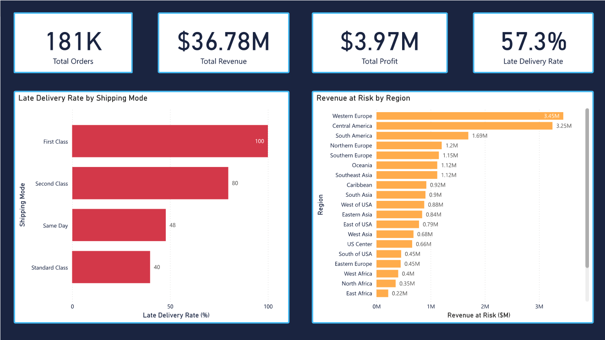
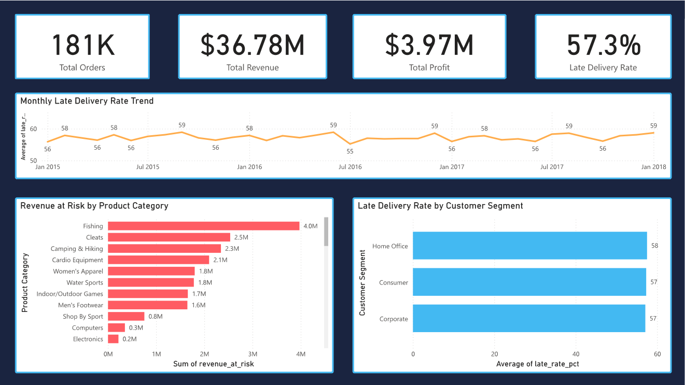
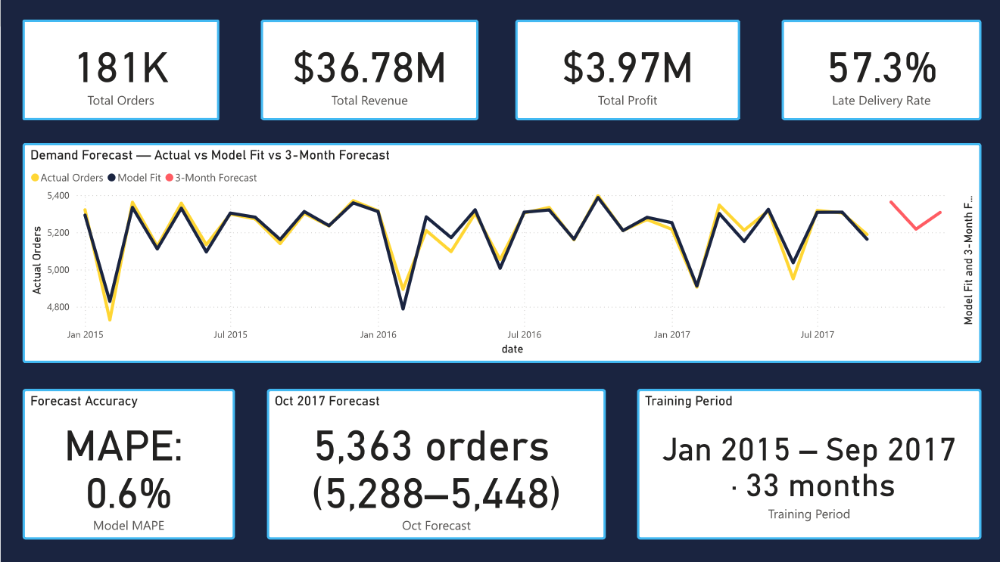

# Supply Chain Intelligence Platform

**Identifying $21M in revenue at risk across 180,519 orders** — end-to-end analytics system built on a star schema, automated ETL pipeline, advanced SQL analytics layer, statistical testing, and Prophet demand forecasting.

> Mid-level Data Analyst Portfolio Project · Python · SQL · Power BI · Prophet

---

## Dashboard Preview

| Page 1 — Operations Overview | Page 2 — Delay Analysis |
|---|---|
|  |  |

| Page 3 — Demand Forecast |
|---|
|  |

---

## The Business Problem

A global retail and logistics company has a **57.3% late delivery rate** — more than half of all orders arrive late. The business knows deliveries are late but cannot answer:

- *Which* shipping modes, regions, and products are causing the most failures?
- *How much* revenue is at risk from late deliveries?
- *Why* is it happening — and what is the root cause?
- *What* will demand look like over the next 3 months?

This project answers all four questions with a complete analytics system built from raw data to executive dashboard.

---

## Key Findings

### 🚨 Finding 1 — First Class shipping has a 100% late delivery rate
Every single First Class order across 27,814 shipments arrived late. This is not random variation — it is a systematic scheduling failure. Standard Class, carrying 60% of all volume, has the lowest late rate at 39.8%.

| Shipping Mode | Late Rate | Avg Days Late | Orders |
|---|---|---|---|
| First Class | **100.0%** | 1.0 | 27,814 |
| Second Class | 79.7% | 2.0 | 35,216 |
| Same Day | 47.8% | 0.5 | 9,737 |
| Standard Class | 39.8% | -0.0 | 107,752 |

### 🌍 Finding 2 — Late delivery is a global systemic problem
All 23 regions show late rates between 51.9% and 60.7% — a spread of only 8.8%. The median delay is 1.0 day in every single region. Geography is not the root cause.

**Highest revenue at risk by region:**
- Western Europe: **$3.45M**
- Central America: **$3.25M**
- South America: **$1.69M**

### 📦 Finding 3 — Three products dominate risk in every region globally
RANK() PARTITION BY analysis across all 23 regions found the same three products holding the top revenue at risk position everywhere simultaneously:

1. Field & Stream Sportsman 16 Gun Fire Safe — **#1 in all 23 regions**
2. Perfect Fitness Perfect Rip Deck — **#2 in 20+ regions**
3. Diamondback Women's Serene Classic Comfort Bi — **#3 in most regions**

Fix fulfilment for these three products and you recover the top risk position across all geographies at once.

### 📉 Finding 4 — Zero improvement in 3 years
Monthly late delivery rate stayed between 55.9% and 60% for all 37 months from January 2015 to September 2017. No seasonal variation. No improving trend. The flat line is the finding.

### 👥 Finding 5 — Top customers receive no preferential treatment
Top 25% of customers by spend generate **$21.5M — 58% of total revenue** and place 20x more orders than bottom-tier customers. Their late delivery rate: **57.0%**. Bottom tier: **57.6%**. A 0.6% difference across a 20x spend gap means zero service differentiation.

### 🔍 Finding 6 — Scheduling gap is the statistically validated root cause
- `is_late` correlates **-0.40** with `days_shipping_scheduled` — longer windows, fewer late orders
- `sales_amount`, `discount_rate`, `profit_ratio` all show **~0.00** correlation with `is_late`
- Chi-square: **χ² = 41,856.90, p ≈ 0** — shipping mode effect is real, not random
- Kruskal-Wallis: **H = 73.50, p = 0.000000184** — regional differences are statistically significant but practically irrelevant (0.15 day spread)

The business is promising delivery windows it cannot consistently fulfil. Order characteristics are irrelevant — the failure is operational.

---

## Architecture

```
Raw CSV · 180,519 rows · 53 columns
              │
              ▼
  ┌───────────────────────┐
  │     ETL Pipeline      │
  │  extract()            │  Load raw CSV
  │  transform()          │  Clean · derive days_late · is_late
  │  load_dim_*()         │  Populate 4 dimension tables
  │  load_fact_orders()   │  Populate fact table
  │  log_pipeline_run()   │  Audit every execution
  └───────────┬───────────┘
              │
              ▼
  ┌───────────────────────────────────────┐
  │         Star Schema · SQLite          │
  │                                       │
  │  dim_date       ──┐                   │
  │  dim_customer   ──┤── fact_orders     │
  │  dim_product    ──┤   (180,519 rows)  │
  │  dim_location   ──┘                   │
  └───────────┬───────────────────────────┘
              │
              ▼
  ┌───────────────────────┐
  │   SQL Analytics Layer │
  │  vw_delivery_perf...  │  Late rate · delays · revenue at risk
  │  vw_monthly_revenue   │  Monthly trend · profit · forecast feed
  │  vw_product_risk      │  Product-level risk and margin
  └───────────┬───────────┘
              │
       ┌──────┴──────┐
       ▼             ▼
  ┌─────────┐  ┌───────────┐
  │  Stats  │  │  Power BI │
  │ Prophet │  │ Dashboard │
  └─────────┘  └───────────┘
```

---

## Project Phases

| Phase | What was built | Key output |
|---|---|---|
| 1 — Star schema | Dimensional data model designed and built | `sql/01_schema.sql` · SQLite DB |
| 2 — ETL pipeline | Modular Python pipeline with logging and audit log | `notebooks/01_etl_pipeline.ipynb` |
| 3 — EDA | 6 findings across 6 analytical dimensions | 6 charts · documented insights |
| 4 — Advanced SQL | CTEs · window functions · 3 SQL views | `notebooks/03_advanced_sql.ipynb` |
| 5 — Statistical analysis | Chi-square · Kruskal-Wallis · Prophet forecast | MAPE 0.6% · 3-month outlook |
| 6 — Power BI dashboard | 3-page executive dashboard on SQL views | `dashboard/Supply_Chain_Intelligence.pbix` |

---

## Star Schema Design

Chose star over snowflake schema — analytics workloads prioritise query simplicity over storage normalisation. Every business question requires exactly one JOIN from the fact table.

```
              dim_date
             (1,127 rows)
                  │
dim_location ─ fact_orders ─ dim_customer
(9,530 rows)  (180,519 rows) (20,652 rows)
                  │
             dim_product
             (118 rows)
```

**Design decisions worth noting:**
- `days_late` and `is_late` are computed columns — they don't exist in source data. `AVG(is_late) * 100` = on-time rate in any query
- Surrogate keys generated for `dim_date` and `dim_location` — no natural key in source
- GPS coordinate averaging applied to collapse 65,384 location variants (from lat/long rounding) into 9,530 true unique locations
- All 4 FK relationships validated post-load — zero orphaned records

---

## Advanced SQL

**Three-layer CTE pattern:**
```sql
WITH base_orders AS (
    -- All joins in one place
    SELECT f.*, l.shipping_mode, p.category_name, c.segment
    FROM fact_orders f
    JOIN dim_location l ON f.location_id = l.location_id
    JOIN dim_product  p ON f.product_id  = p.product_id
    JOIN dim_customer c ON f.customer_id = c.customer_id
),
delivery_flags AS (
    -- Add delay severity band
    SELECT *, CASE
        WHEN days_late <= 0            THEN 'On Time'
        WHEN days_late BETWEEN 1 AND 2 THEN 'Slightly Late'
        ELSE                                'Severely Late'
    END AS delay_band FROM base_orders
),
kpi_summary AS (
    -- Aggregate
    SELECT shipping_mode, delay_band,
           COUNT(*) AS total_orders,
           ROUND(AVG(is_late) * 100, 1) AS late_rate_pct
    FROM delivery_flags GROUP BY shipping_mode, delay_band
)
SELECT * FROM kpi_summary;
```

**Window functions used:**

| Function | Applied to |
|---|---|
| `LAG()` | Month-over-month order volume and revenue change |
| `SUM() OVER()` | Running total revenue across 37 months |
| `RANK() PARTITION BY order_region` | Product risk ranking within each of 23 regions |
| `NTILE(4)` | Customer spend quartile segmentation |
| `SUM() OVER()` inside CTE | Percentage share of total revenue at risk |

---

## Statistical Analysis

**Test 1 — Chi-square (does shipping mode affect late delivery rate?)**
```
χ² statistic : 41,856.90
P-value      : ~0.0000000000
Result       : SIGNIFICANT — effect is real, not random chance
```

**Test 2 — Kruskal-Wallis (does delay magnitude differ across regions?)**
```
H statistic  : 73.50
P-value      : 0.000000184
Result       : Statistically SIGNIFICANT — practically IRRELEVANT
               Mean delay spread: 1.53 to 1.68 days across 23 regions
               Difference of 0.15 days has zero operational impact
```

The regional test demonstrates the distinction between statistical and practical significance — with 180,519 rows, even trivial differences become detectable.

---

## Demand Forecasting

**Model:** Facebook Prophet · yearly seasonality · additive mode · 95% confidence intervals

**Training:** January 2015 — September 2017 (33 months)
October 2017 onwards excluded — a -56.5% MoM drop identifies data truncation, not a real business event.

| Metric | Result | Industry benchmark |
|---|---|---|
| MAPE | **0.6%** | Good = under 10% |
| MAE | **28.6 orders/month** | Off by 29 orders on 5,211 base |
| RMSE | **41.0 orders** | No large outlier errors |

**3-Month Forecast:**

| Month | Predicted | Lower (95%) | Upper (95%) |
|---|---|---|---|
| Oct 2017 | 5,363 | 5,288 | 5,448 |
| Nov 2017 | 5,218 | 5,142 | 5,302 |
| Dec 2017 | 5,307 | 5,225 | 5,386 |

Model validated on the 3 months immediately before the forecast window — off by 10, 4, and 25 orders respectively. All actuals land within the 95% confidence interval.

---

## Power BI Dashboard

Connected directly to SQLite SQL views — not raw CSV files. Three pages:

**Page 1 — Operations Overview**
KPI cards · Late delivery rate by shipping mode · Revenue at risk by region

**Page 2 — Delay Analysis**
Monthly late rate trend (3-year flat line) · Revenue at risk by product category · Late rate by customer segment

**Page 3 — Demand Forecast**
Actual vs model fit vs 3-month forecast · Forecast accuracy cards · Training period summary

---

## How to Run

```bash
# 1. Clone
git clone https://github.com/yourusername/supply-chain-intelligence.git
cd supply-chain-intelligence

# 2. Create virtual environment
python -m venv venv
source venv/bin/activate        # Mac/Linux
venv\Scripts\activate           # Windows

# 3. Install dependencies
pip install pandas numpy matplotlib seaborn scikit-learn \
            statsmodels prophet apscheduler jupyter ipykernel

# 4. Register Jupyter kernel
python -m ipykernel install --user \
    --name=supply-chain-venv \
    --display-name "Supply Chain Intelligence"

# 5. Download dataset
# https://www.kaggle.com/datasets/shashwatwork/dataco-smart-supply-chain-for-big-data-analysis
# Save to: data/raw/DataCoSupplyChainDataset.csv

# 6. Run notebooks in order
# 00_data_loading → 01_etl_pipeline → 02_eda → 03_advanced_sql → 04_statistical_forecasting

# 7. Open dashboard
# Open dashboard/Supply_Chain_Intelligence.pbix in Power BI Desktop
```

---

## Tech Stack

`Python 3.11` · `pandas` · `SQLite` · `Prophet` · `scipy` · `matplotlib` · `seaborn` · `Power BI` · `SQL`

---

## Dataset

[DataCo Smart Supply Chain for Big Data Analysis](https://www.kaggle.com/datasets/shashwatwork/dataco-smart-supply-chain-for-big-data-analysis)

180,519 orders · 53 columns · 23 global regions · January 2015 — January 2018

---

*Built to demonstrate end-to-end analytics engineering — dimensional modelling, pipeline design, advanced SQL, statistical analysis, forecasting, and business intelligence.*
